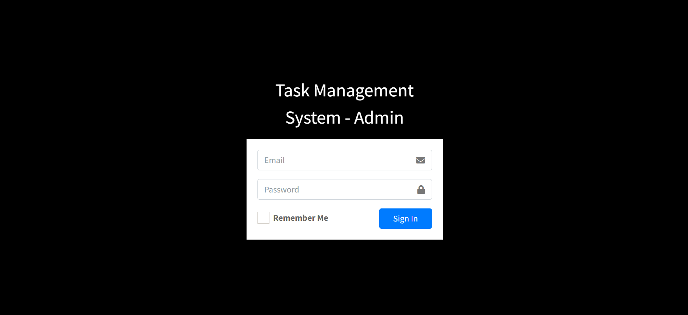

# 🗂️ Task Management System (TMS)

## 📌 Project Overview

The **Task Management System** (TMS) is a web-based application designed to streamline task tracking, improve project visibility, and enhance collaboration within an organization. It enables users—Admins, Managers, and Employees—to manage tasks efficiently with features such as role-based access, deadline alerts, CRUD operations, and real-time reporting.

---

## 🧠 Features

- 🔐 Role-based login (Admin / Manager / Employee)
- ✅ Task creation, assignment, and status tracking
- 🗃️ Project and user management (CRUD)
- ⏰ Deadline alerts and progress visualization
- 📊 Project reporting and exportable data
- 🔍 Dashboard views tailored to each role
- 🔐 Secure login with hashed credentials and session management

---

## 🛠️ Tech Stack

- **Frontend**: HTML5, CSS3, JavaScript
- **Backend**: PHP
- **Database**: MySQL
- **Hosting Environment**: XAMPP / WAMP
- **Security**: Input validation, HTTPS, session control

---

## 🧪 Setup Instructions

1. **Install XAMPP/WAMP** for local development
2. Place project files inside `htdocs` (for XAMPP)
3. Start Apache and MySQL
4. Create a MySQL database named `tms_db`
5. Import the provided SQL file to initialize tables
6. Update `db_connect.php` with your credentials

---

## 🔐 Role-Based Access

| Role     | Capabilities |
|----------|--------------|
| Admin    | Add managers/employees, create projects, assign tasks |
| Manager  | Assign and monitor tasks, approve users |
| Employee | Accept tasks, update progress, submit reports |

---

## 📸 Screenshots

-Login page
-  
- Home Dashboard  
- CRUD for Projects, Tasks, and Users  
- Task Status & Progress Tracking  
- Reports Panel

---

## 📈 Future Scope

- 📱 Mobile App Support
- 🔔 Notification System Integration (Email/SMS)
- 🧠 AI-powered Task Recommendation
- 📊 Advanced Analytics Dashboards
- 🔐 Two-Factor Authentication

---

## 📚 References

- Gartner, OpenAI Research, PMI PMBOK 7th Ed.
- Sommerville, Schwalbe, Beck & Andres – Agile Methodologies
- Cisco Collaboration Whitepapers

---

## 📬 Contact

For any queries, reach out to:

**Bathula Sai Charan**  
📧 saicharanbathula34@gmail.com  
📞 6309444011  
🌐 [LinkedIn](https://www.linkedin.com/in/bathula-sai-charan-a91549290) | [GitHub](https://github.com/saicharanbathula)

---

